# Práctica Módulo 04 - Contenedores

Proyecto académico con el objetivo de utilizar la infraestructura de Google Kubernetes Engine ([enunciado](./Enunciado-Practica_Contenedores.pdf)).

## Instalación de requisitos

Se ha comprobado la ejecución correcta de los ejercicios en un sistema operativo [Debian 9](https://www.debian.org/index.es.html), con las siguientes aplicaciones previamente instaladas:

* [Google Cloud SDK](https://cloud.google.com/sdk/install) 264.0.0.
  * alpha 2019.09.22.
  * beta 2019.0.22.
  * bq 2.0.47.
  * core 2019.09.22.
  * gsutil 4.42.
  * kubectl 2019.09.22.
* [Docker](https://docs.docker.com/install/linux/docker-ce/debian/) 19.03.2, build 6a30dfca03.
* [Docker Compose](https://docs.docker.com/compose/install/) 1.24.1, build 4667896b.
* [Git](https://www.git-scm.com/) 2.11.0.

Instalar "*Google Cloud SDK*":

```bash
export CLOUD_SDK_REPO="cloud-sdk-$(lsb_release -c -s)"
echo "deb http://packages.cloud.google.com/apt $CLOUD_SDK_REPO main" | sudo tee -a /etc/apt/sources.list.d/google-cloud-sdk.list
curl https://packages.cloud.google.com/apt/doc/apt-key.gpg | sudo apt-key add -
sudo apt-get update && sudo apt-get install google-cloud-sdk -y
```

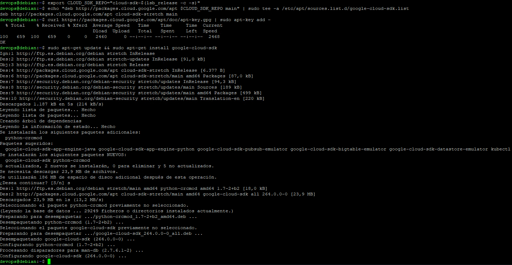

Inicializar el SKD "*Google Cloud SDK*":

```bash
gcloud init
```

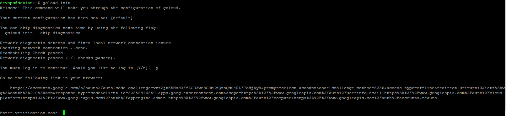

Hacer login con la guenta de Google:


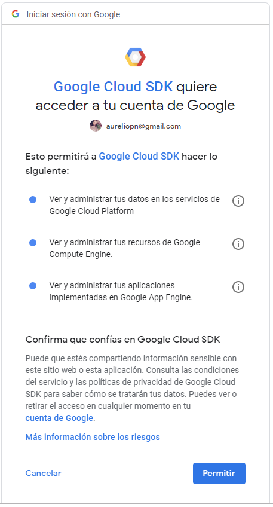

Copiar el código obtenido en la consola:

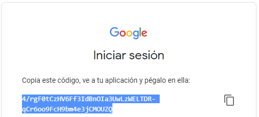

Seleccionar el proyecto "*practica-kc-04-contenedores*":

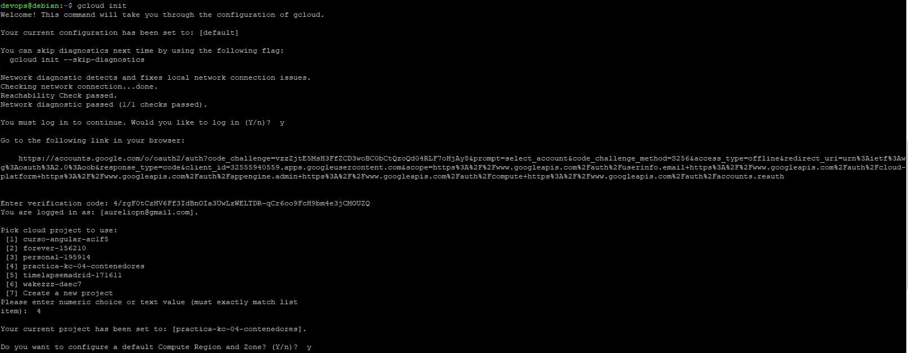

Escoger como region por defecto la *17* ("*europe-west1-b*"):

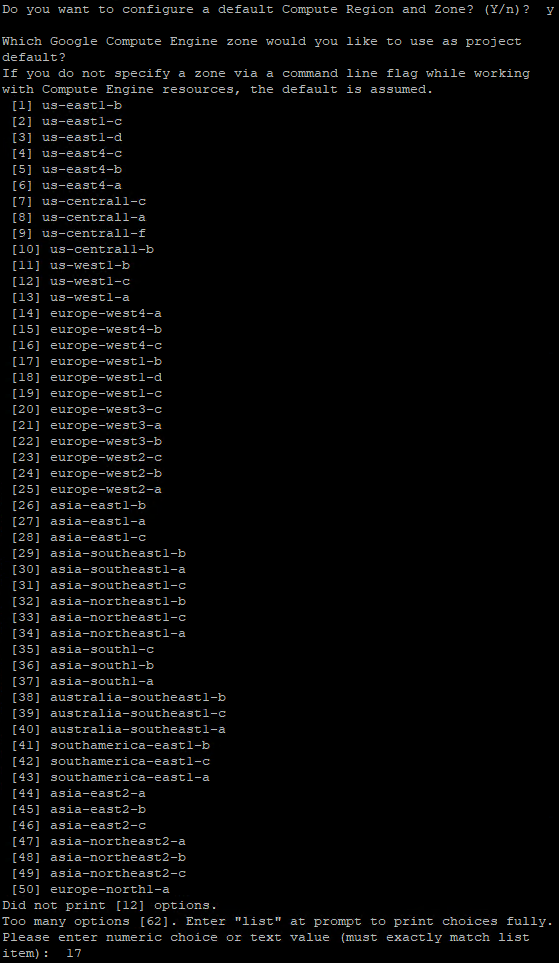

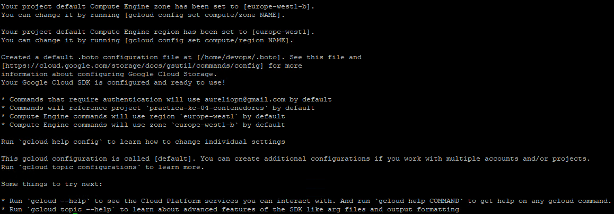

Comprobar la instalación del SKD "*Google Cloud SDK*":

```bash
gcloud --version
```

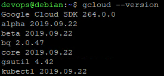

Instalar "*Docker*" añadiendo nuestro usuario al grupo "docker":

```bash
sudo apt-get install apt-transport-https ca-certificates curl gnupg2 software-properties-common -y
curl -fsSL https://download.docker.com/linux/debian/gpg | sudo apt-key add -
sudo add-apt-repository "deb [arch=amd64] https://download.docker.com/linux/debian $(lsb_release -cs) stable"
sudo apt-get update
sudo apt-get install docker-ce -y
sudo usermod -aG docker devops
exit
```

Comprobar la instalación de Docker:

```bash
docker --version
```

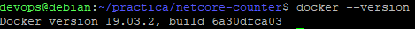

Instalar "*Docker Compose*":

```bash
sudo curl -L "https://github.com/docker/compose/releases/download/1.24.1/docker-compose-$(uname -s)-$(uname -m)" -o /usr/local/bin/docker-compose
sudo chmod +x /usr/local/bin/docker-compose
docker-compose --version
```

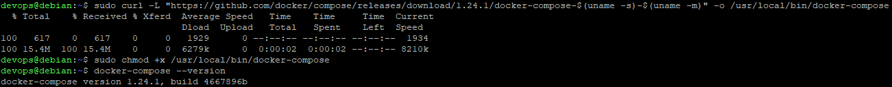

Instalar *[kubectl](https://kubernetes.io/es/docs/tasks/tools/install-kubectl/)*:

```bash
sudo apt-get install kubectl -y
```

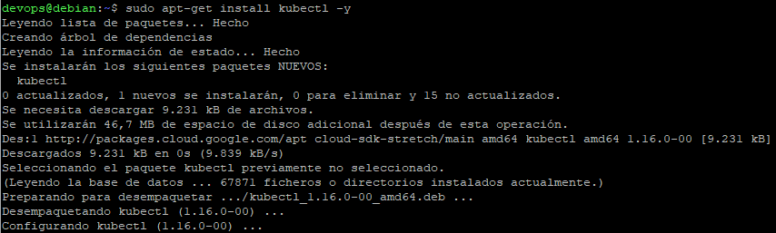

Instalar "*Git*":

```bash
sudo apt-get install git -y
```

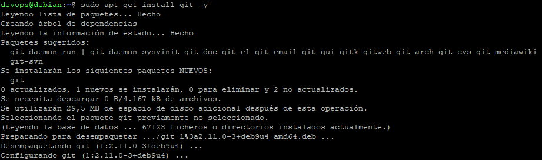

Clonar este repositorio, y el de la aplicación ["*netcore-counter*"](https://github.com/UREURE/netcore-counter.git), en el directorio "*practica*":

```bash
mkdir practica
cd practica
git clone https://gitlab.keepcoding.io/URE/contenedores.git
git clone https://github.com/UREURE/netcore-counter.git
cd ..
```

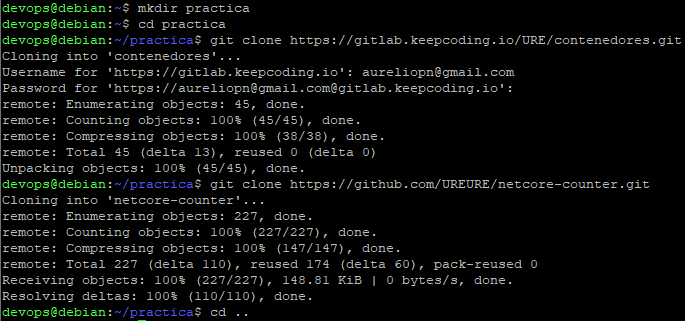

Dar acceso completo al proyecto "*practica-kc-04-contenedores*" al usuario "​pmoncadaisla@gmail.com", con rol "*editor*":

```bash
gcloud projects add-iam-policy-binding practica-kc-04-contenedores --member user:pmoncadaisla@gmail.com --role roles/editor
```

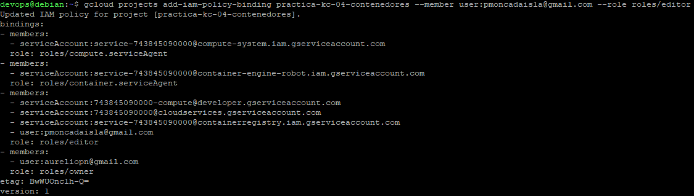

## Ejecutar la aplicación con Docker-compose

Ejecutar la aplicación de prueba con "*Docker Compose*" (terminar con "Ctrl+C"):

```bash
cd practica/netcore-counter/solution
sudo chmod 700 *.sh
./start.sh
cd ../../..
```

Se puede acceder a la aplicación a través de la siguiente dirección:

* [http://localhost:5010/api/v1/swagger/index.html](http://localhost:5010/api/v1/swagger/index.html)

## Desplegar la aplicación en Kubernetes de GKE sin Helm

Crear clúster de Kubernetes en GKE con un máximo de 3 nodos:

```bash
gcloud container clusters create practica --zone europe-west1-b --enable-stackdriver-kubernetes --enable-autoscaling --max-nodes=3
```

Conectar con el clúster de Kubernetes:

```bash
gcloud container clusters get-credentials practica --zone europe-west1-b --project practica-kc-04-contenedores
```

Instalar [*Ingress Controller*](https://github.com/kubernetes/ingress-nginx/blob/master/docs/deploy/index.md):

```bash
kubectl create clusterrolebinding cluster-admin-binding --clusterrole cluster-admin --user $(gcloud config get-value account)
kubectl apply -f https://raw.githubusercontent.com/kubernetes/ingress-nginx/master/deploy/static/mandatory.yaml
kubectl apply -f https://raw.githubusercontent.com/kubernetes/ingress-nginx/master/deploy/static/provider/cloud-generic.yaml
```

Instalar la aplicación

```bash
cd practica/netcore-counter/k8s
chmod 700 *.sh
./start-kubernetes.sh <poner_aquí_la_contraseña_que_se_desee_para_el_servicio_Redis>
cd ../../..
```

Obtener la IP del balanceador del objeto Ingress "*netcore-counter*":

```bash
kubectl get ingress netcore-counter --namespace=netcore-counter
```

Modificar el host del archivo "*practica/netcore-counter/k8s/07_counter-ingress.yaml*", estableciendo la IP obtenida en el campo "*ADDRESS*" con la instrucción anterior. Después, ejecutar:

```bash
kubectl apply -f ./practica/netcore-counter/k8s/07_counter-ingress.yaml --namespace=netcore-counter
```

Se puede acceder a la aplicación a través de la siguiente dirección:

* [http://netcore-counter.34.76.93.8.nip.io/api/v1/swagger/index.html](http://netcore-counter.34.76.93.8.nip.io/api/v1/swagger/index.html)

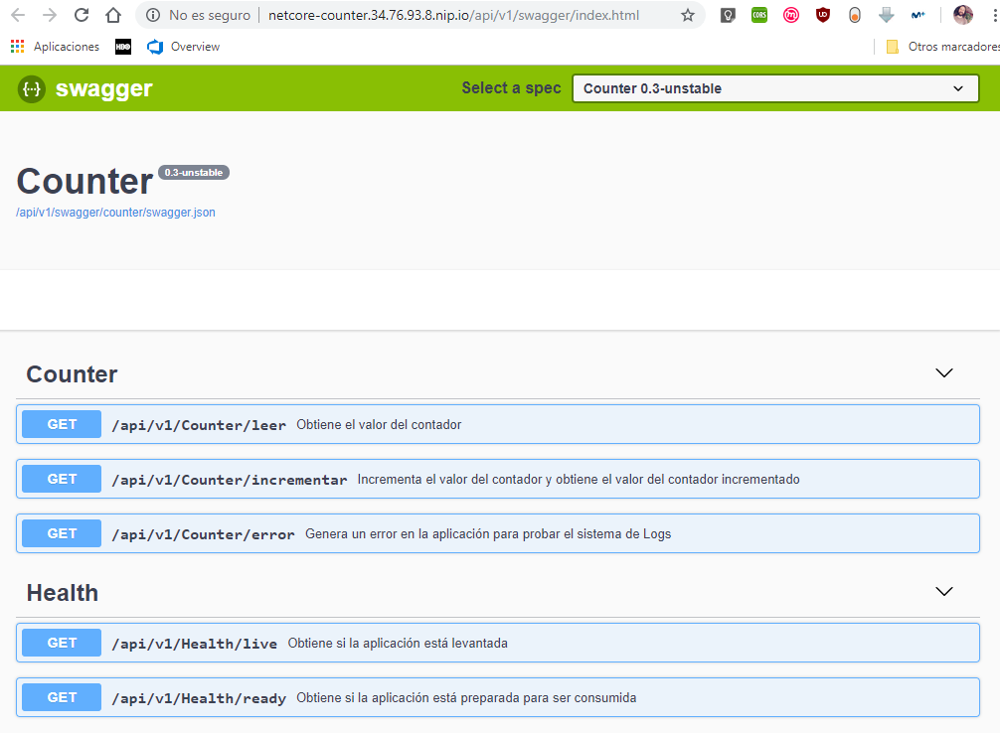

## Desplegar la aplicación en Kubernetes de GKE con Helm

Crear clúster de Kubernetes en GKE con un máximo de 4 nodos:

```bash
gcloud container clusters create practica-helm --zone europe-west1-b --enable-stackdriver-kubernetes --enable-autoscaling --max-nodes=4
```

Conectar con el clúster de Kubernetes:

```bash
gcloud container clusters get-credentials practica-helm --zone europe-west1-b --project practica-kc-04-contenedores
```

Instalar *Ingress Controller*:

```bash
kubectl create clusterrolebinding cluster-admin-binding --clusterrole cluster-admin --user $(gcloud config get-value account)
kubectl apply -f https://raw.githubusercontent.com/kubernetes/ingress-nginx/master/deploy/static/mandatory.yaml
kubectl apply -f https://raw.githubusercontent.com/kubernetes/ingress-nginx/master/deploy/static/provider/cloud-generic.yaml
```

Instalar *[Helm](https://helm.sh/docs/helm/)*:

```bash
cd practica/netcore-counter/helm
chmod 700 *.sh
./helm_install.sh
cd ../../..
```

Instalar la aplicación con Helm:

```bash
cd practica/netcore-counter/charts/netcore-counter/
helm dependency update
cd ..
helm install --name netcore-counter netcore-counter --namespace=helm-test --set replicas=2 --set tag=0.4-unstable
cd ../../..
```

Obtener la IP del balanceador del objeto Ingress "*netcore-counter*":

```bash
kubectl get ingress netcore-counter --namespace=helm-test
```

Modificar el host del archivo "*practica/netcore-counter/k8s/07_counter-ingress.yaml*" estableciendo la IP obtenida en el campo "*ADDRESS*" con la instrucción anterior. Después, ejecutar:

```bash
kubectl apply -f ./practica/netcore-counter/k8s/07_counter-ingress.yaml --namespace=helm-test
```

Se puede acceder a la aplicación a través de la siguiente dirección:

* [http://netcore-counter.35.233.36.7.nip.io/api/v1/swagger/index.html](http://netcore-counter.35.233.36.7.nip.io/api/v1/swagger/index.html)

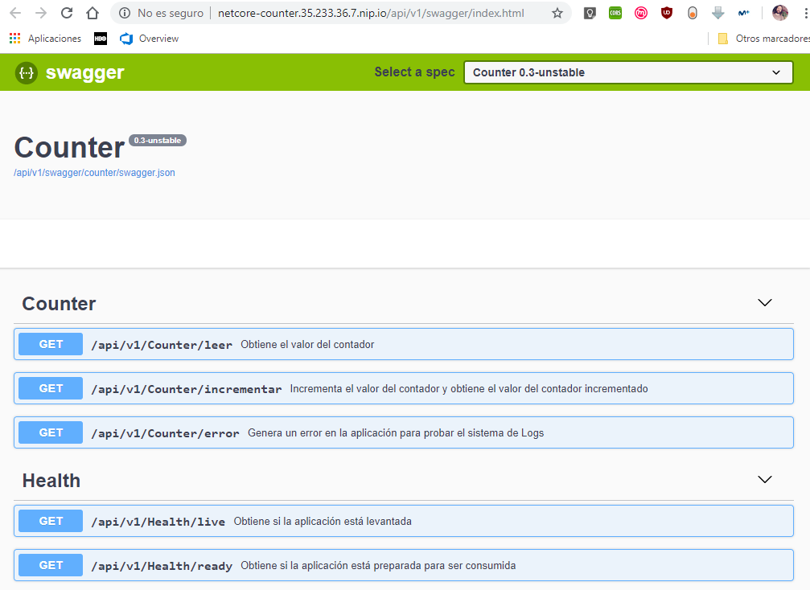

## Registro de Logs de la aplicación

Se puede generar un error utilizando (el navegador dará un error 500):

* [http://netcore-counter.34.76.93.8.nip.io/api/v1/Counter/error](http://netcore-counter.34.76.93.8.nip.io/api/v1/Counter/error)
* [http://netcore-counter.35.233.36.7.nip.io/api/v1/Counter/error](http://netcore-counter.35.233.36.7.nip.io/api/v1/Counter/error)

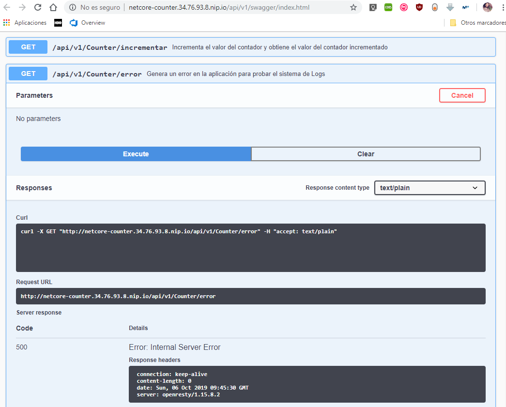

Los errores se publican en formato JSON en una sola línea, y son capturados con [Stackdriver](https://cloud.google.com/stackdriver/?hl=es-419) en el campo "*jsonPayload*".

* [Logs netcore-counter](https://console.cloud.google.com/logs?advancedFilter=resource.type%3D%22k8s_container%22%0Aresource.labels.project_id%3D%22practica-kc-04-contenedores%22%0Aresource.labels.location%3D%22europe-west1-b%22%0Aresource.labels.cluster_name%3D%22practica-helm%22%0Aresource.labels.namespace_name%3D%22helm-test%22%0Alabels.k8s-pod%2Frun%3D%22netcore-counter%22&interval=NO_LIMIT&project=practica-kc-04-contenedores):

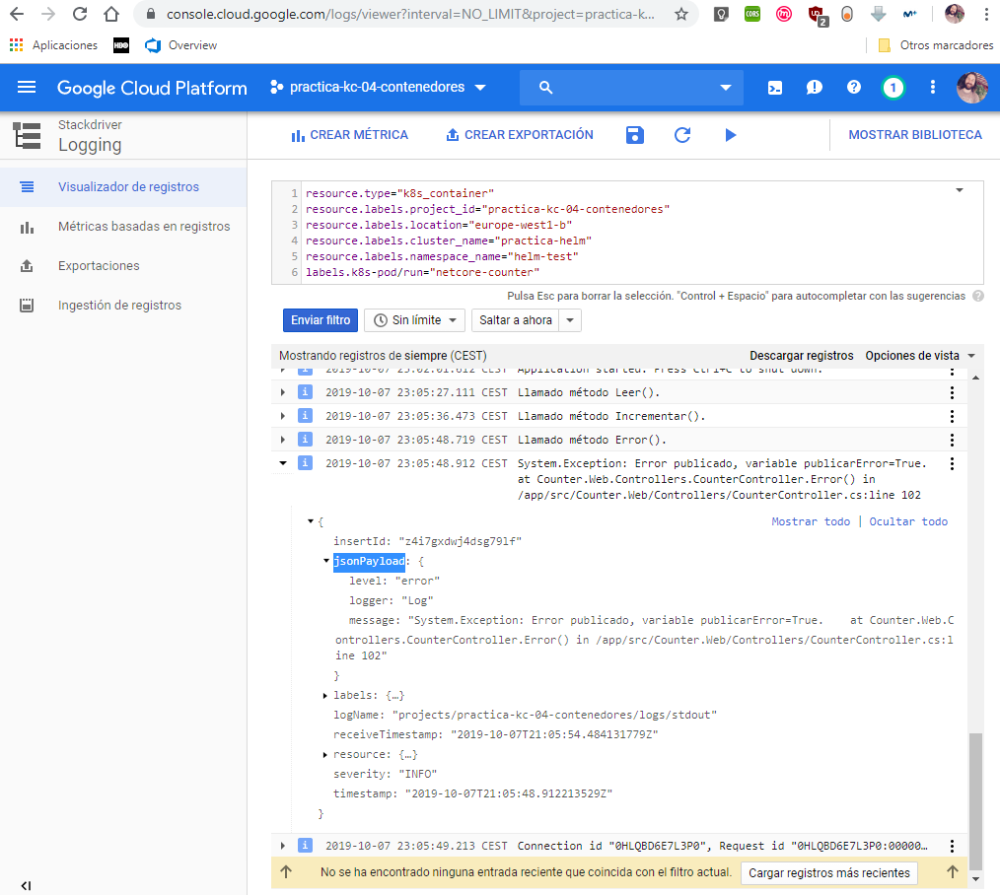

## Affinity y Anti-affinity

Para que los PODs de la base de datos y de la aplicación permanezcan lo más juntos posible, se utilizó el "*podAffinity*":

```yaml
        podAntiAffinity:
          requiredDuringSchedulingIgnoredDuringExecution:
          - labelSelector:
              matchExpressions:
              - key: run
                operator: In
                values:
                - netcore-counter
            topologyKey: "kubernetes.io/hostname"
```

Para que los PODs de la aplicación permanezcan lo más separados posible, se utilizó el "*podAntiAffinity*":

```yaml
        podAffinity:
          preferredDuringSchedulingIgnoredDuringExecution:
          - weight: 100
            podAffinityTerm:
              labelSelector:
                matchExpressions:
                - key: app
                  operator: In
                  values:
                  - redis
              topologyKey: "kubernetes.io/hostname"
```

## Instalar Prometheus-Operator con Helm

Conectar con el clúster de Kubernetes que tiene Helm instalado:

```bash
gcloud container clusters get-credentials practica-helm --zone europe-west1-b --project practica-kc-04-contenedores
```

Instalar [Prometheus-Operator](https://github.com/coreos/prometheus-operator) con Helm, exponer [Grafana](https://grafana.com/) con el ojbeto [*Ingress*](./01-practica/monitoring/monitoring-ingress.yaml), e instalar el [*Service Monitor*](./01-practica/monitoring/netcore-counter-service-monitor.yaml) para que Prometheus recolecte la información de nuestro servicio:

```bash
cd practica/contenedores/01-practica/monitoring
sudo chmod 700 *.sh
./instalar_prometheus_operator.sh
./instalar_service_monitor.sh
cd ../../../..
```

El usuario administrador de Grafana es "admin" y la contraseña se puede obtener con:

```bash
cd practica/contenedores/01-practica/monitoring
sudo chmod 700 *.sh
./get_password_grafana.sh
cd ../../../..
```

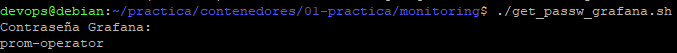

Grafana y Prometheus estarán disponibles fuera del clúster en las siguientes direcciones (tras cambiar las IPs en los campos *Host* del Ingress, si resultase necesario):

* [http://monitoring-grafana.35.233.36.7.nip.io/](http://monitoring-grafana.35.233.36.7.nip.io/)
* [http://monitoring-prometheus.35.233.36.7.nip.io/](http://monitoring-prometheus.35.233.36.7.nip.io/)

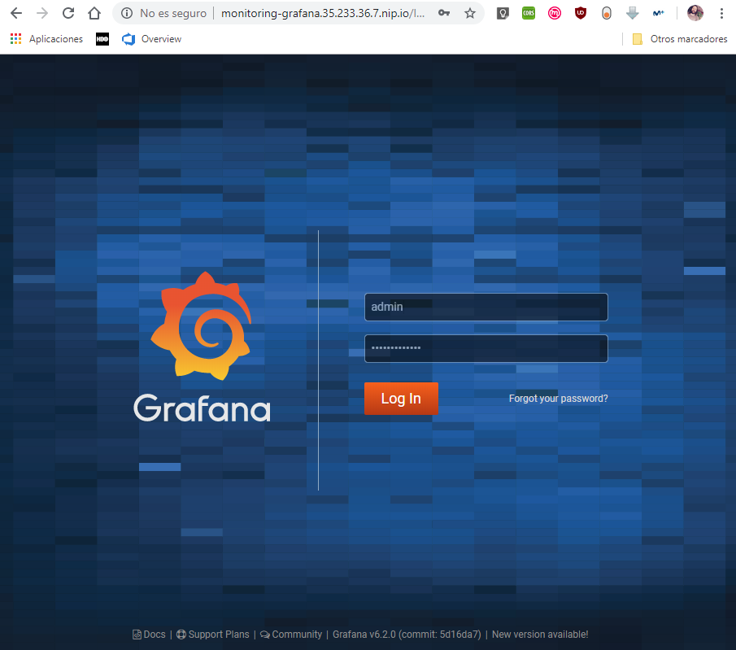

Se puede importar el Dashboard con código "[10427](https://grafana.com/grafana/dashboards/10427)":

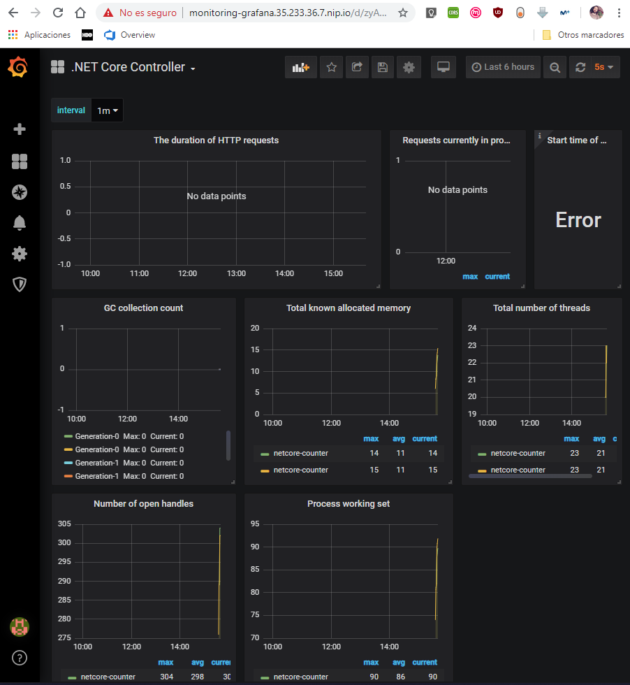

Se puede utilizar el Dashboard personalizado "[Dashboard_Peticiones_netcore-counte.json](.01-practica/monitoring/Dashboard_Peticiones_netcore-counte.json)", y editarlo según convenga:

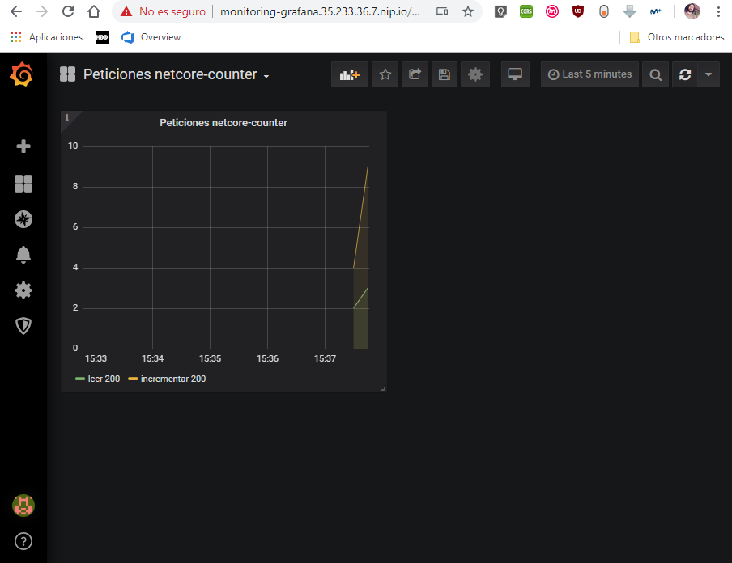

# TODO: A partir de este punto está sin terminar, no invertir tiempo en evaluar

## Uptime Checks

[https://app.google.stackdriver.com/uptime/7e699252a0125e6fc34392336f60bc51?project=practica-kc-04-contenedores](https://app.google.stackdriver.com/uptime/7e699252a0125e6fc34392336f60bc51?project=practica-kc-04-contenedores)
